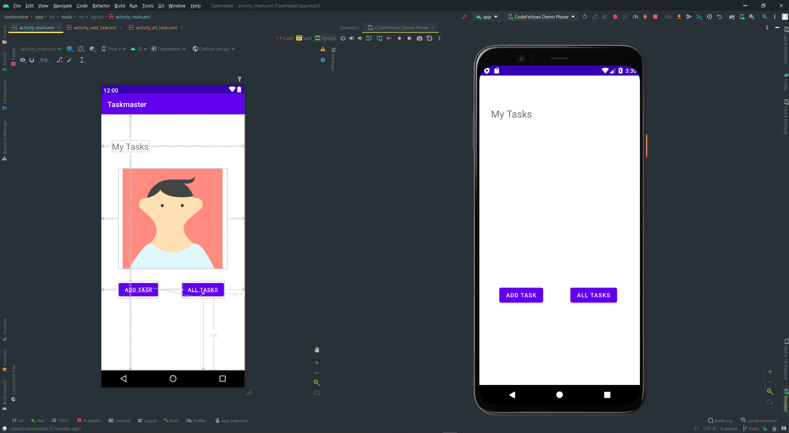
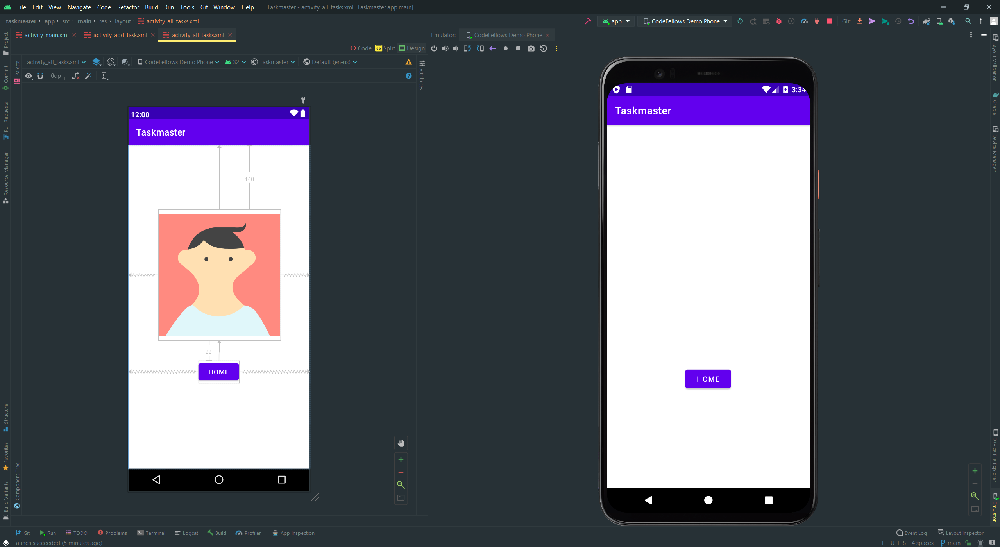
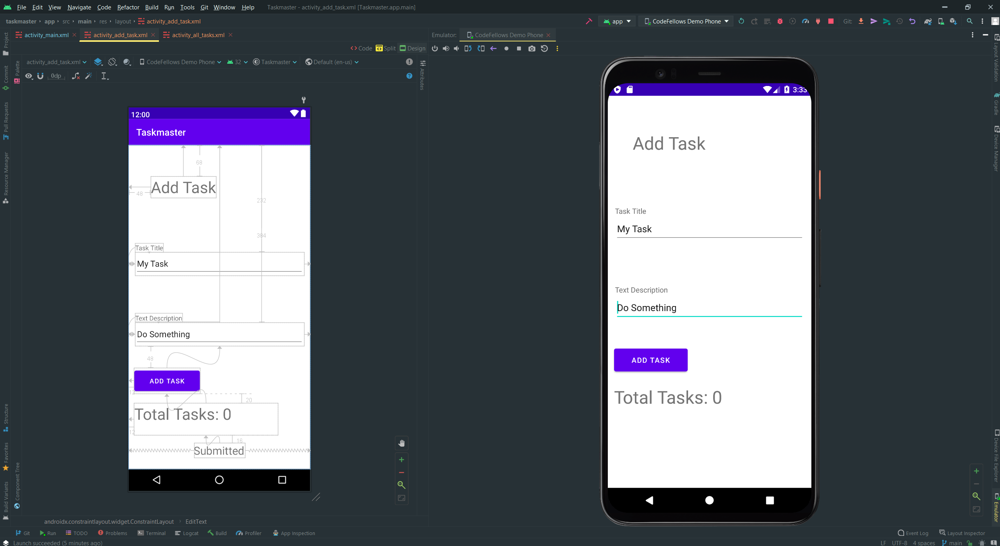
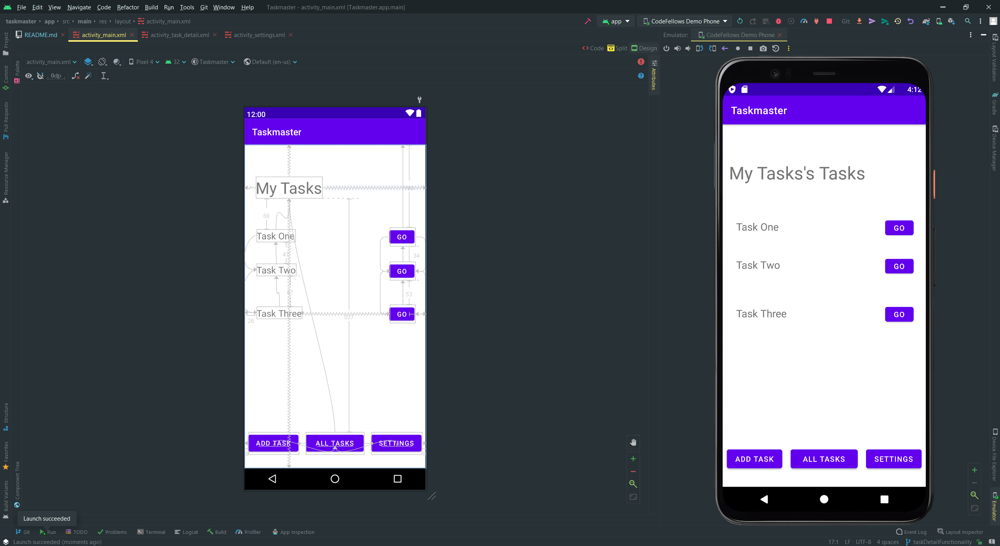
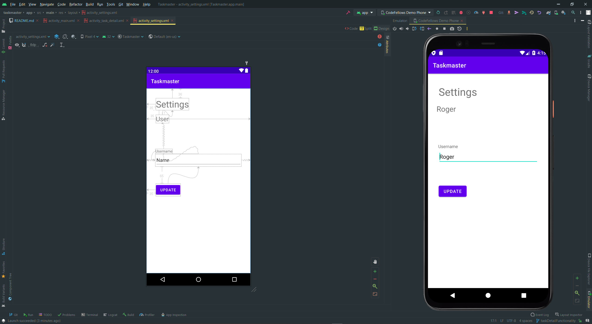
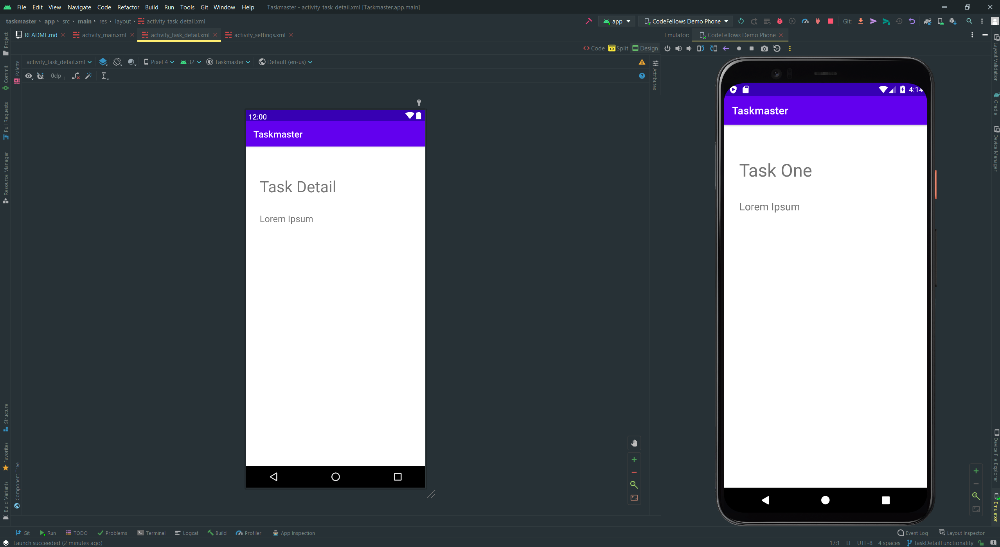

# TaskMaster

## Lab26

### Summary

Today I created a home page that has two buttons. The add Task button is routed to the add task xml which displays two input text boxes, a total task text, and a add task button. The add task button has an onClick event listener that will change the text of a blank text box at the bottom of the screen to show submitted. The routing for the all task is also set up but no functionality at this time.

## Lab27

### Summary

Today's Lab we dipped into shared preferences and extras. The homepage was updated to have buttons that go to a settings activity as well as task detail activity. On the settings page you are able to update the username shared preference which is displayed in multiple places. The Task Detail buttons on the home page will pass in an extra of the Text adjacent to the button and sets the Title of the task page.

